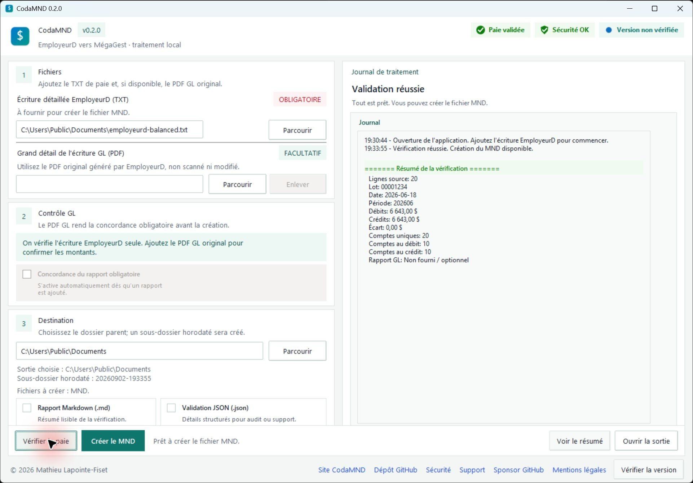

# CodaMND

<p align="center">
  <strong>De l'écriture détaillée EmployeurD au fichier MND, simplement.</strong>
</p>



<p align="center">
  <a href="https://github.com/sponsors/MathieuLF"><strong>Sponsor GitHub</strong></a>
</p>

## En bref

CodaMND est une application Windows qui transforme une écriture détaillée EmployeurD au format TXT en fichier `.mnd` que vous pourrez ensuite vérifier dans MégaGest.

Avant de créer le fichier, l'application vérifie notamment la structure de l'écriture et l'équilibre entre les débits et les crédits. Vous pouvez aussi ajouter le PDF original du grand détail GL produit par EmployeurD afin de comparer les totaux et les montants par compte.

Tout se fait sur votre ordinateur : CodaMND n'envoie pas vos fichiers de paie sur Internet.

## Télécharger CodaMND

Les versions officielles se trouvent sur la page [GitHub Releases](https://github.com/MathieuLF/codamnd/releases). Téléchargez le fichier `CodaMND-v*-portable.zip`, puis extrayez-le avant d'ouvrir l'application.

## Comment l'utiliser

1. Ajoutez l'écriture détaillée EmployeurD au format TXT.
2. Ajoutez, si vous l'avez, le PDF original du grand détail GL. Un PDF numérisé ou modifié ne pourra pas être vérifié de façon fiable.
3. Cliquez sur `Vérifier la paie`.
4. Si tout est conforme, cliquez sur `Créer le MND`.
5. Testez toujours le fichier obtenu dans MégaGest hors production avant de l'utiliser réellement.

Sans dossier de sortie choisi, CodaMND place les résultats dans un nouveau dossier horodaté sous `Documents`.

### Première ouverture sur Windows

Windows SmartScreen peut afficher un avertissement au premier lancement, car l'application n'est pas signée numériquement.

Si vous avez téléchargé le ZIP depuis la page officielle GitHub Releases, choisissez `Informations complémentaires`, puis `Exécuter quand même`.

## Vos données restent privées

Les fichiers traités restent sur votre ordinateur. Ne publiez jamais un fichier de paie réel, un rapport GL, un fichier MND ou une capture contenant des renseignements personnels dans GitHub ou dans un autre service public.

Pour demander de l'aide, décrivez le problème avec un exemple fictif ou une capture soigneusement anonymisée. Consultez [Sécurité](SECURITY.md) et [Support](SUPPORT.md) pour savoir quoi inclure.

## Pages utiles

- [Guide rapide](docs/guide_utilisateur.md)
- [Formats des fichiers](docs/formats.md)
- [Sécurité](SECURITY.md)
- [Support](SUPPORT.md)
- [Sponsor GitHub](https://github.com/sponsors/MathieuLF)
- [Mentions légales](docs/mentions_legales.md)
- [Licence MIT](LICENSE)

## Contribuer

Le code source est public sous licence MIT. Pour préparer l'environnement de développement et lancer la validation complète :

```powershell
python -m pip install -e .
python scripts/agent_validate.py
```

La validation courante ne demande ni base de données, ni serveur, ni clé secrète.

## Licence

CodaMND est distribué sous licence MIT. EmployeurD, PG Solutions, MégaGest et les autres marques citées appartiennent à leurs propriétaires respectifs.
